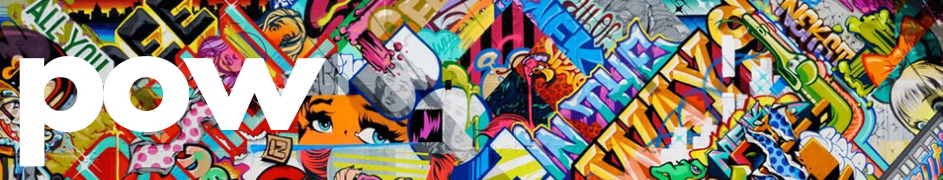

by [Jen Brissman](https://www.linkedin.com/in/jenbrissman/) | [brissman514@gmail.com](mailto:brissman514@gmail.com?subject=[GitHub]%20Pow) | [Shopify Backend Intern Challenge](https://docs.google.com/document/d/1ZKRywXQLZWOqVOHC4JkF3LqdpO3Llpfk_CkZPR8bjak/edit#heading=h.n7bww7g70ipk)

## What is POW?
POW - otherwise known as “Paint on Walls” is a communal photo sharing platform for lovers of street art.

Table of Contents
------
- [Tech Stack](#Tech)
- [Testing](#Testing)
- [Features](#Features)
- [Install](#Install)
- [Meet the Developer](#Meet)
- [Looking Ahead](#Future)

## Tech Stack

- **Frontend**: JavaScript | HTML5 | CSS | Bootstrap
- **Backend**: Python3 | Flask | SQLAlchemy | Jinja2
- **APIs**: Cloudinary | GoogleMaps
- **Database**: PostgreSQL

## Testing

## Features
[Login](#Login) | [Gallery](#Gallery) | [Location](#Location) | [View](#View) | [Search](#Search) | [Upload](#Upload) | [Logout](#Logout) | [Database](#SQLDBM)

## Login and Registration
Users can register and create an account which will give them access to the public street art gallery, as well as the option to upload photos of their own. I have hashed the user's credentials with sha256 to add security for the user. I built Pow with Flask - creating a service that uses a Postgres database interfaced with the SQLAlchemy ORM.

## Gallery
After logging in, the user will be brought to the public street art gallery. This gallery represents the full database of photos uploaded by the POW community of users. Each photo is displayed on a responsive card that I have styled using Bootstrap and CSS. Hover over an image and the card flips to display information about the specific street art piece on the back. This information is being dynamically displayed using Jinja templating and includes the title and artist, as well as links to a full-size image of the piece, and its location.

## Location
Clicking on the "location" button opens Google Maps to show exactly where that piece of art is located.

## View Image
Clicking on the "view image" button opens a full size view of the particular piece of art.

## Search
To filter through the cards, I developed a search feature by adding a JavaScript event listener that evaluates keystrokes to hide the cards that do not contain text matching the query string.

## Upload Image
To upload a photo to the community library, I built a form which takes in the title, the artist, and the location using Google’s Map & Places API with their Place Autocomplete service. For the image file itself I implemented Cloudinary’s media management API, which returns the url for the image uploaded to my database.

## My Pics
Clicking 'my pics' in the nav bar will apply a filter on the galley that shows on your uploads, where you can see the specific photos you have added to the Pow community.

## Log Out

## Data Model

## Looking Ahead
I really loved making this app. It was my first experience creating a public community based application. Moving forward, I want to implement Amazon’s Rekognition feature so that the search function can search characteristics of the images, not just a string search of the information in the database/information displayed on the cards. For more information on other features in development and to peep my code, please visit my GitHub. Thank you for taking the time to learn a bit about POW, I really look forward to connecting with you!

## Install

## Meet the Developer
Jen is an adventurous world traveler who enjoys mountain biking, snowboarding, running, scuba diving, cooking/baking, and is happiest in hiking boots. Recently she held the position of Senior Operations Manager at a private investment office in New York City, where she was promoted twice within the company 2013 to 2021. Jen has also worked in lifestyle management at Luxury Attaché, and as a professional organizer/productivity consultant at DwellWell. 
In addition to this, she has also had a successful career as a theatre, tv, film, voiceover, commercial actress and model in New York City, and holds a BFA from the UC Conservatory of Music, which accepts only the top 1% of applicants. 
A tenacious multi-hyphenate, Jen is a driven and focused problem solver who has a knack for seeing the bigger picture in any situation. In this ever-changing world, her intuition has led her into an exciting new career in software development. She is a contributing member of Artists Who Code, an online community of artists in tech.
Connect with [Jen Brissman](https://www.linkedin.com/in/jenbrissman/) on LinkedIn!