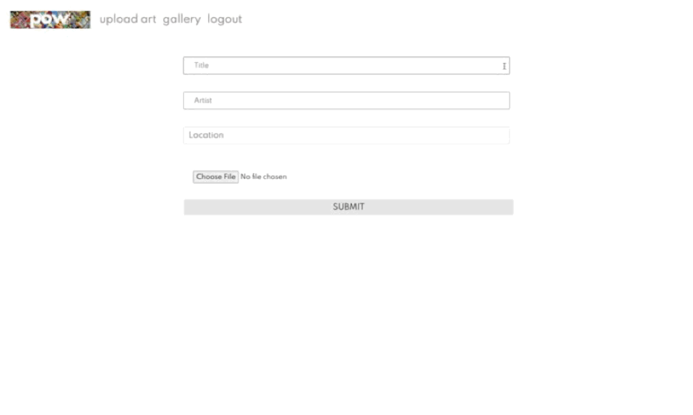

by [Jen Brissman](https://www.linkedin.com/in/jenbrissman/) | [brissman514@gmail.com](mailto:brissman514@gmail.com?subject=[GitHub]%20Pow) | [Watch the demo!](https://www.youtube.com/) | [Shopify Backend Intern Challenge](https://docs.google.com/document/d/1ZKRywXQLZWOqVOHC4JkF3LqdpO3Llpfk_CkZPR8bjak/edit#heading=h.n7bww7g70ipk)

Table of Contents
------
- [Tech Stack](#Tech)
- [Testing](#Testing)
- [About](#About)
- [Features](#Features)
- [Install](#Install)
- [Meet the Developer](#Meet)
- [Looking Ahead](#Future)

## Tech Stack

- **Frontend**: JavaScript | HTML5 | CSS | Bootstrap
- **Backend**: Python3 | Flask | SQLAlchemy | Jinja2
- **APIs**: Cloudinary | GoogleMaps
- **Database**: PostgreSQL

## Testing

## About

## Features

## Login and Registration

## Gallery

## Location

## View Image

## Upload Image

## Log Out

## Data Model

## Install

## Meet the Developer

Jen is an adventurous world traveler who enjoys mountain biking, snowboarding, running, scuba diving, cooking/baking, and is happiest in hiking boots. Recently she held the position of Senior Operations Manager at a private investment office in New York City, where she was promoted twice within the company 2013 to 2021. Jen has also worked in lifestyle management at Luxury Attaché, and as a professional organizer/productivity consultant at DwellWell. 
In addition to this, she has also had a successful career as a theatre, tv, film, voiceover, commercial actress and model in New York City, and holds a BFA from the UC Conservatory of Music, which accepts only the top 1% of applicants. 
A tenacious multi-hyphenate, Jen is a driven and focused problem solver who has a knack for seeing the bigger picture in any situation. In this ever-changing world, her intuition has led her into an exciting new career in software development. She is a contributing member of Artists Who Code, an online community of artists in tech.

Connect with [Jen Brissman](https://www.linkedin.com/in/jenbrissman/) on LinkedIn!

## Looking Ahead
